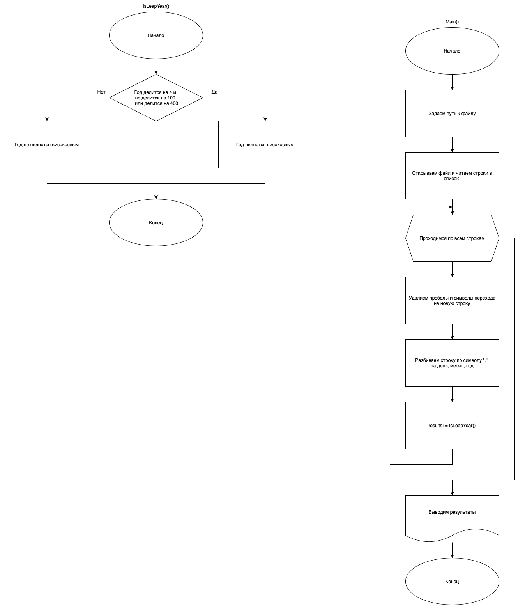
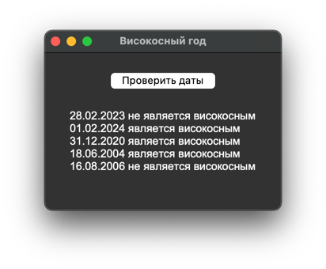

# Практическая работа №16 #
### Тема: Формирование  потока ввода-вывода ###
### Цель: совершенствование навыков составления  программ  на основе потоков ###
#### Вариант №12 ####
#### Задача: ####

> Описать тип TDate — запись с полями целого типа Day (день), Month (месяц) и Year (год) — и функцию LeapYear(D) логического типа с параметром типа TDate, которая возвращает TRUE, если год в дате D является високосным, и FALSE в противном случае. Вывести значение функции LeapYear для пяти данных дат (данные хранятся в файле). Високосным считается год, делящийся на 4, за исключением тех годов, которые делятся на 100 и не делятся на 400.  

##### Контрольный пример: #####

> Ввожу: "file Dates"  
> Получаю: "  
28.02.2023 не является високосным  
01.02.2024 является високосным  
31.12.2020 является високосным  
18.06.2004 является високосным  
16.08.2006 не является високосным"


##### Системный анализ: #####

>Входные данные: `file Dates`  
>Промежуточные данные данные: `str Dates`, `list lines`, `int Y`, `int day`, `int month`, `int year`      
>Выходные данные: `str results`  


##### Блок схема: #####



##### Код программы: #####

```python
import os
import tkinter as tk


def IsLeapYear(Y, date_str):
    # Определяет, является ли год Y високосным и возвращает результат в виде строки
    if (Y % 4 == 0 and Y % 100 != 0) or (Y % 400 == 0):
        return f"{date_str} является високосным\n"
    else:
        return f"{date_str} не является високосным\n"


def main():
    Dates = "/Users/vill/Desktop/tex/Ucheb_PR/RAZ_PM_1/Dates"

    with open(Dates, "r") as file:
        lines = file.readlines()

    results = ""  # Переменная для хранения всех результатов
    for line in lines:
        date_str = line.strip()  # Убираем пробелы и символы новой строки
        day, month, year = map(int, date_str.split('.'))  # Разбиваем строку и преобразуем части в числа
        results += IsLeapYear(year, date_str)  # Добавляем результат к общей строке

    label1.config(text=results)  # Обновляем текст виджета сразу со всеми результатами


root = tk.Tk()
root.title("Високосный год")
root.geometry("300x200")

btn = tk.Button(root, text="Проверить даты", command=main)
btn.pack(pady=20)

label1 = tk.Label(root, text="", font=("Arial", 14), justify="left")
label1.pack()

root.mainloop()

```

##### Результат работы программы: #####
> Оконное:
* Вводим:  
`file Dates`        




##### Вывод по проделанной работе: #####
> Я написал программу для определения вискосокосности года в оконном варианте.